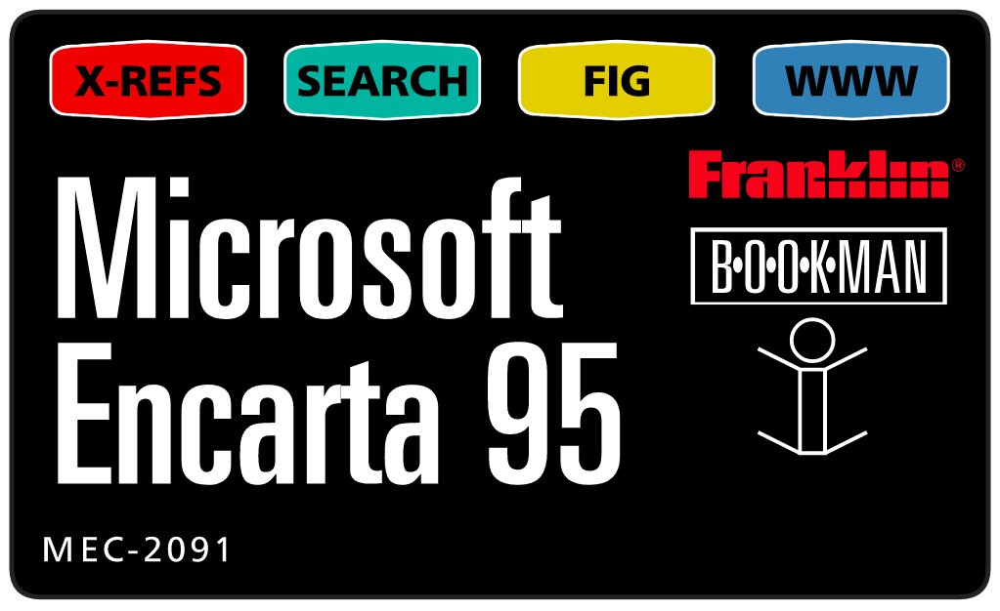
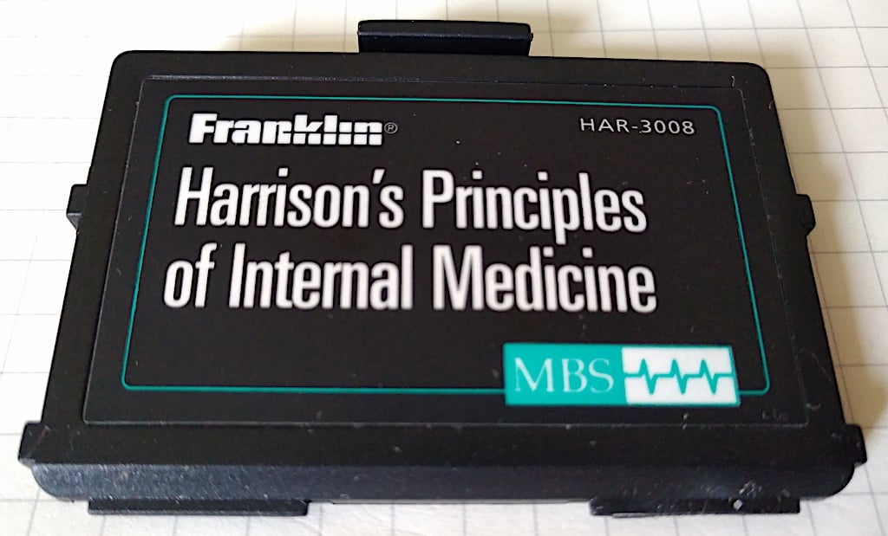
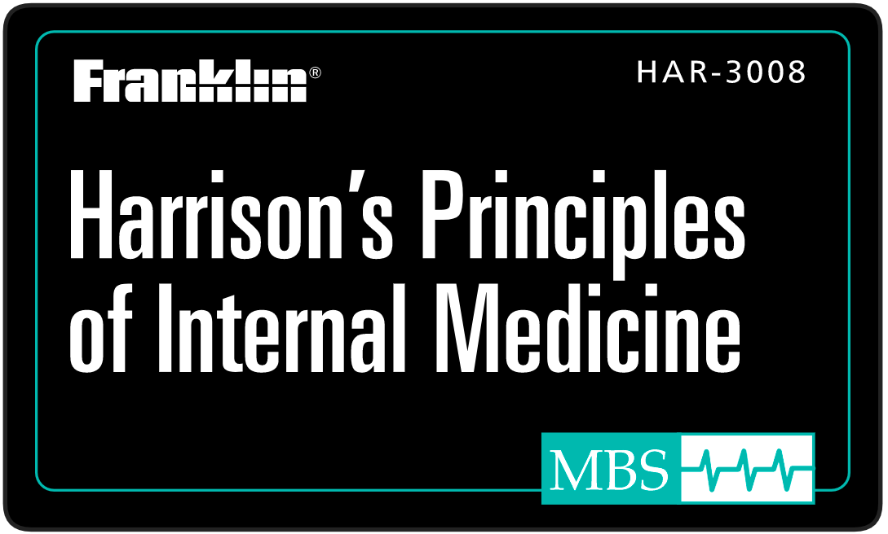

# BOOKMAN Label Maker

This tool is used to create replacement labels for Franklin BOOKMAN cartridges that have faded or otherwise deteriorated labelling. The generated labels are output in SVG and can be printed at 100% scale for a 1:1 reproduction size suitable for application on worn ROM cards. See the [Bookman Archive](https://jsyang.ca/franklin-electronics/carts) for examples of ROM cards.

<table>
  <tr>
    <td width="50%"></td>
    <td width="50%"></td>
  </tr>
</table>

## Usage
You can use this code:
- as a NodeJS library (`require('bookman-label-maker')`)
- through its web interface locally via (`npm run start`)
- online at https://franklin-bookman-label-maker.herokuapp.com/

## MIT Licensed
